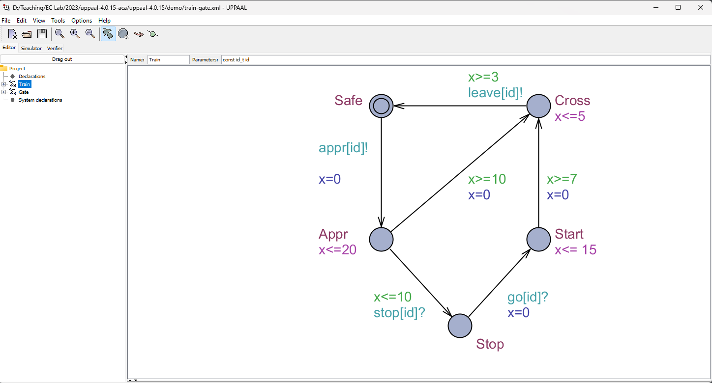
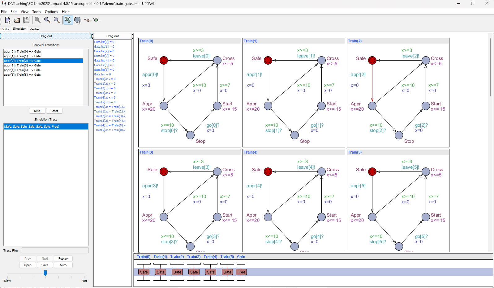
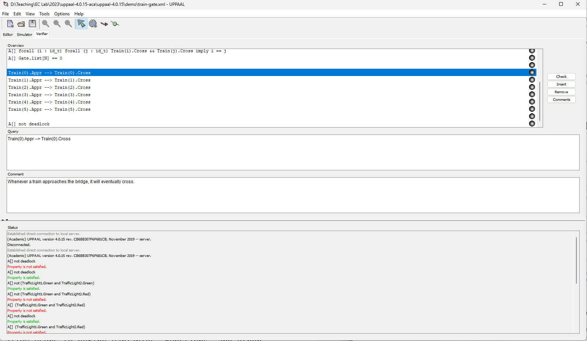

# Modelling State Machines in UPPAAL

## Introduction

Discrete-time modeling is a powerful approach in systems design, allowing us to represent and analyze systems that evolve over distinct, separated intervals of time. This method is particularly valuable in scenarios where continuous modeling might be overly complex or not applicable. Within the realm of discrete-time modeling, state machines emerge as a pivotal concept. These state machines, or automata, serve as abstract representations of systems that transition between various states, making them instrumental in modeling the behavior of a multitude of applications. As we explore this domain further, tools such as UPPAAL become indispensable. UPPAAL offers a comprehensive platform for simulating and verifying the behavior of state machines, ensuring their robustness and accuracy. To provide a tangible understanding, we will delve into a real-world application by modeling a traffic light system at a city cross-section, exemplifying the practical relevance of discrete-time modeling and state machines in everyday scenarios.

_Figure 1: City Cross Section_

## State Machines

State machines, often known as automata, have roots that trace back to the early theories of computation and logic. Their inception can be linked to mathematicians and logicians like Alan Turing, who conceptualized the Turing machine as a fundamental model of computation, and John von Neumann, who pioneered the early architecture of electronic computers. Historically, one of the first applications of state machines was in telephone switching systems, where they were used to manage and direct calls based on user inputs. Similarly, early computer algorithms, especially in text processing and searching, employed finite automata to recognize patterns and sequences.

At its core, a state machine is an abstract representation of a system, capturing its various possible conditions or "states" and the rules that dictate how it transitions between these states. Over time, state machines have evolved from theoretical constructs to practical tools, with applications ranging from digital circuit design to software development. They serve as a bridge between the logical design and the tangible implementation, allowing for systematic modeling of complex systems in a structured and predictable manner.

### Components of State Machine

**States**: At the heart of every state machine lie its states, which represent the distinct conditions or situations a system can be in. Each state captures a specific configuration or behavior of the system. For instance, in the context of a digital watch, states might include "Displaying Time," "Setting Alarm," or "Timer Countdown." The system can only be in one state at any given time, and as events occur or conditions are met, it transitions from one state to another.

**Transitions**: Transitions define the pathways or conditions that enable a system to move from its current state to another. Every transition is associated with specific criteria that must be satisfied for the shift to occur. Two primary components characterize transitions:

**Guards**: A guard is a boolean expression that determines whether a transition is permissible. For the transition to be taken, the guard's condition must evaluate to true. For example, a digital watch might have a guard that checks if the current time equals the alarm time to transition from the "Displaying Time" state to the "Alarm Ringing" state.

**Set Actions**: Once a transition is taken, certain operations or set actions are executed. Using the digital watch example, a set action upon entering the "Alarm Ringing" state might be to initiate the alarm sound.
Initial and Final States: Every state machine starts its operation from a predefined state known as the initial state. This state serves as the entry point, setting the system in motion. On the other hand, some state machines have designated final or terminal states. Upon reaching a final state, the system concludes its operation, indicating the end of its process.

**Variables and Clocks**: Variables play a pivotal role in state machines, representing parameters that can change over time and influence the system's behavior. A common variable in many state machines is the clock, which measures the passage of time. Clocks can be used in guards to determine when transitions should occur based on time elapsed.

## UPPAAL

UPPAAL stands as an integrated tool environment specifically designed for the modeling, simulation, and verification of real-time systems delineated by networks of timed automata. Originating from joint efforts between Uppsala University and Aalborg University, UPPAAL incorporates a rich set of features. Its core is built upon formal methods, leveraging timed automata theory to ensure systematic and precise analysis. The environment offers an intricate graphical interface that allows users to construct and visualize state machines. Beyond basic timed automata, UPPAAL supports advanced functionalities such as stochastic hybrid systems and cost-optimal modeling that fits the complexities of real-time system design and verification.

[Download Uppaal 4.0](https://www.it.uu.se/research/group/darts/uppaal/download.html)

### Designing State Machines in UPPAAL

#### Interface Overview

**Editor**: This is the primary workspace where users design state machines as shown in fig XYZ. It provides a canvas for drawing locations (states), transitions, and annotating them with relevant properties.

_Figure 2: Editor tab in UPPAL_

**Simulator**: Once a model is constructed, the simulator allows users to execute the state machine in a step-by-step manner, observing its behavior in response to different inputs and conditions. XYZ shows the simulator view in UPPAAL.

_Figure 3: Simulator tab in UPPAL_

**Verifier**: This component is essential for the model checking process. Users can specify properties they wish to verify against their model, and the verifier evaluates whether the state machine satisfies these properties.

_Figure 4: Verifier tab in UPPAL_

**Property and Declaration Panes:**: Located in the Editor tab, these sections of the interface allow users to define variables, functions, and other declarations essential for the model.

### Modeling Basics

**Defining Locations, Transitions, and Initial States:** In the Editor pane, you can easily define locations by placing circles and labeling them. Transitions are represented by arrows connecting these locations. Every state machine must have an initial state, distinguished by a double circle, indicating the starting point of the system.

**Incorporating Clock Variables and Constraints:** Clock variables are essential for timed automata. In the Declarations pane, you can define clock variables, and subsequently, in the Editor, you can annotate transitions and locations with clock constraints, specifying the timing behavior of the system.

**Synchronization Channels and Urgent Actions:** UPPAAL allows for modeling of concurrent systems using synchronization channels. These channels enable communication between different automata, ensuring coordinated behavior. Channels are declared in the Declarations pane and are used in transitions as synchronization labels. Urgent actions are special constructs in UPPAAL that force the system to take a particular transition as soon as its guard is enabled, without any delay.

**System Declarations:** While individual state machines capture the behavior of single components, real-world systems often consist of multiple interacting components. UPPAAL allows construction of such multi-component systems using the system declaration.
In the Declarations pane, after defining the individual automata, you can specify a system declaration that initializes and runs the automata concurrently. This declaration looks like:

$$ system Automaton1, Automaton2; $$

It indicates that Automaton1 and Automaton2 should run concurrently and may interact through synchronization channels if defined.

### Simulation Basics

Navigate to the Simulator pane and click on the "Next" or "Auto" button. "Next" allows you to manually step through simulation one transition at a time. While the simulation is paused at any point, you can inspect the current state, variable values, and clock valuations.

As the simulation progresses, UPPAAL provides a real-time visualization in the right pane. Locations change color based on their active/inactive status, and transitions animate as they're taken, offering a dynamic view of the system's behavior.

## Model Verification in UPPAAL

Timed CTL (TCTL) extends the traditional Computation Tree Logic (CTL) by introducing timing constraints, making it particularly suitable for real-time systems. The primary operators in TCTL are:

### Path Quantifiers:

- **A** (For all paths): Represents universal quantification over paths.
- **E** (There exists a path): Denotes existential quantification over paths.

### Temporal Modalities:

- **G** (Globally/Always): Asserts that a property holds continuously.
- **F** (Future): Indicates that a property will hold at some point in the future.

UPPAAL leverages TCTL to formulate verification queries, providing a tailored set of operators:

- **A[ ]:** Represents "on all paths, always." It asserts that a property holds universally on all paths and at all time points.
  For example, **A[ ]** $\phi$: means $\phi$ is always true everywhere.
- **A< >:** Denotes "on all paths, eventually." It asserts that a property will hold at some point in the future on all paths.
  For instance, **A<>** $\phi$: indicates that $\phi$ will become true at some future time on all execution paths.
- **E[ ]:** Represents "there exists a path, always." It signifies that there's at least one path where a property continuously holds. For example, **E[ ]** $\phi$: means there's a path where $\phi$ is always true.
- **E< >:** Denotes "there exists a path, eventually." It states that there's at least one path where a property will hold in the future. **E< >** $\phi$: asserts there exists a path where $\phi$ will eventually become true.
- **p->q:** Denotes implication. It asserts that whenever property $p$ holds, property $q$ must also hold. It's commonly used to represent system guarantees, such as "if condition $p$ is met, then outcome $q$ will follow."
